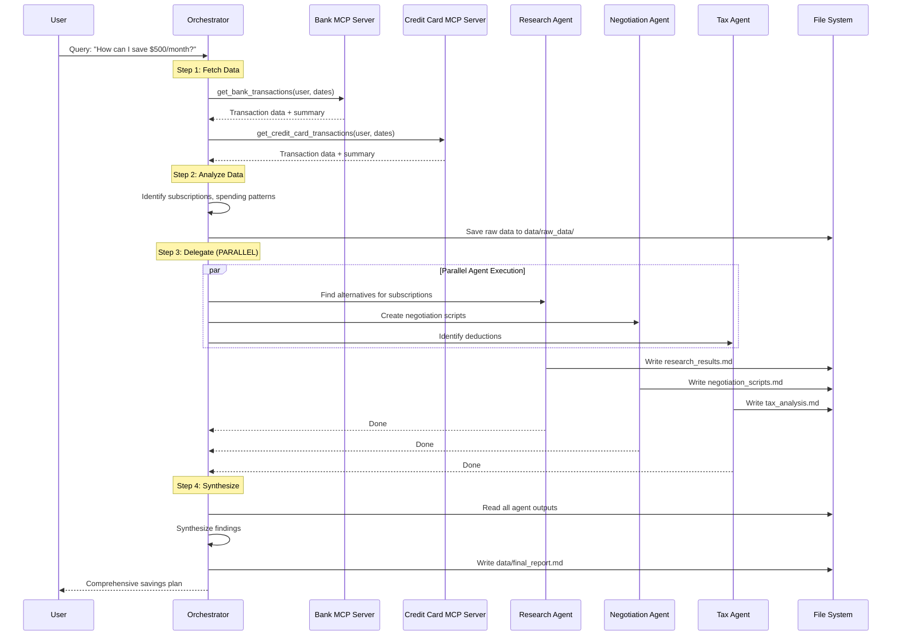
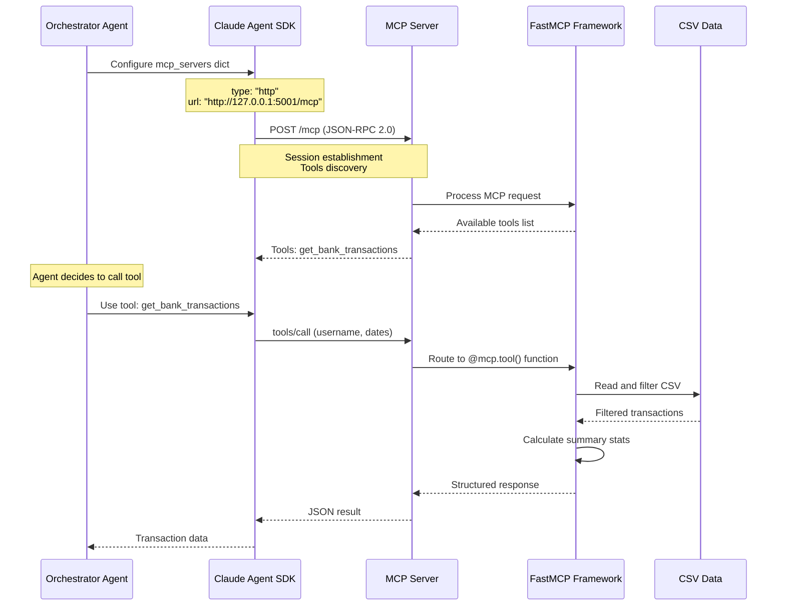
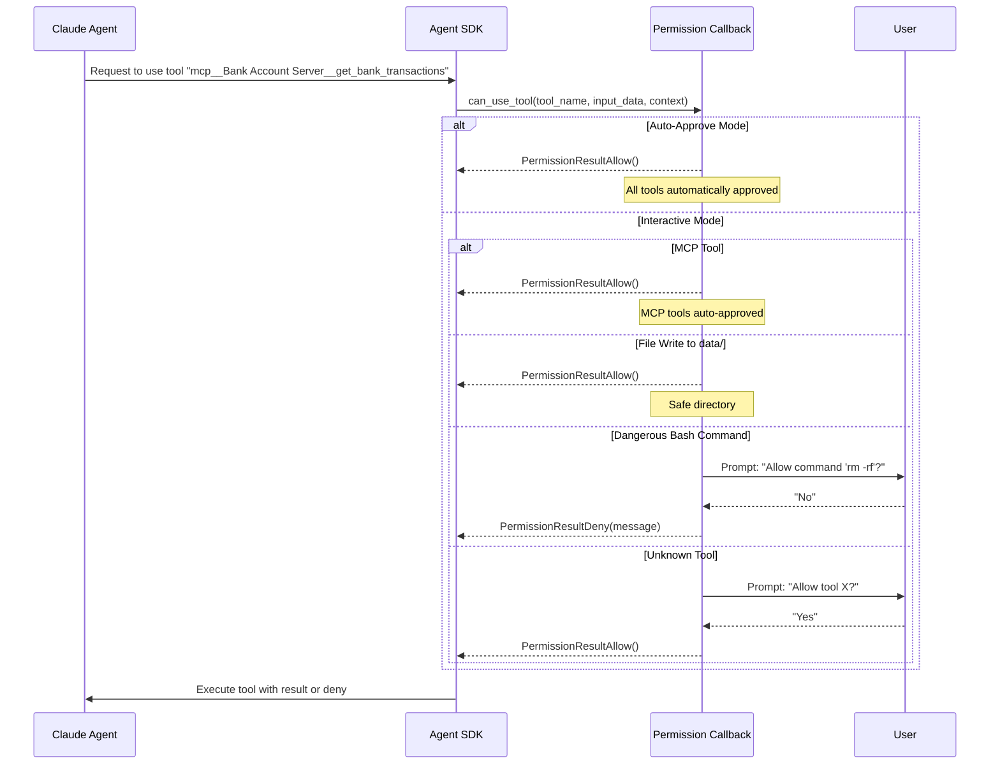
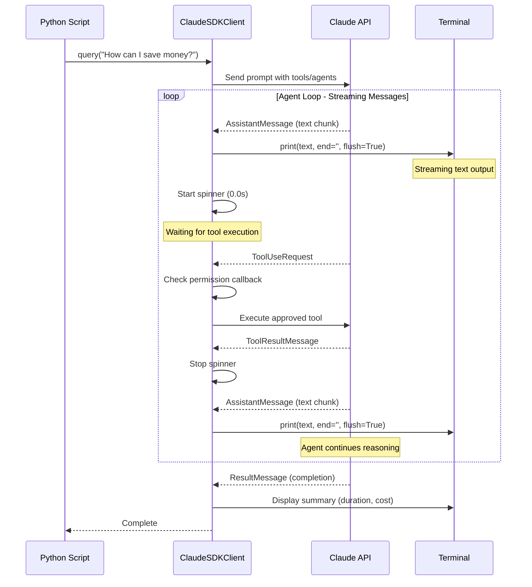

# Financial Orchestrator Agent - Architecture Guide

This document provides a comprehensive explanation of the financial orchestrator agent system, from high-level architecture to low-level implementation details.

## Table of Contents

- [High-Level Architecture](#high-level-architecture)
- [System Components](#system-components)
- [Sequence Diagrams](#sequence-diagrams)
- [Low-Level Implementation](#low-level-implementation)
- [Agent Loop Mechanics](#agent-loop-mechanics)
- [Code Walkthrough](#code-walkthrough)

---

## High-Level Architecture

### Overview

The Financial Orchestrator Agent demonstrates the **orchestrator-workers pattern** using Claude Agent SDK. This pattern is ideal for complex tasks that can be decomposed into independent subtasks handled by specialized agents.

### Architecture Pattern: Orchestrator-Workers

```
┌─────────────────────────────────────────────────────────┐
│                     User Query                          │
│          "How can I save $500 per month?"              │
└────────────────────┬────────────────────────────────────┘
                     │
                     ▼
┌─────────────────────────────────────────────────────────┐
│              Orchestrator Agent (Sonnet)                │
│  - Fetches data from MCP servers                       │
│  - Analyzes spending patterns                          │
│  - Delegates to specialized agents IN PARALLEL         │
│  - Synthesizes results into final report              │
└────────────┬────────────────────────────────────────────┘
             │
             ├──────────────┬──────────────┬──────────────┐
             ▼              ▼              ▼              ▼
    ┌────────────┐  ┌────────────┐  ┌────────────┐  ┌────────┐
    │  Research  │  │Negotiation │  │    Tax     │  │  MCP   │
    │   Agent    │  │   Agent    │  │   Agent    │  │ Tools  │
    │  (Haiku)   │  │  (Haiku)   │  │  (Haiku)   │  │        │
    └────────────┘  └────────────┘  └────────────┘  └────────┘
         │               │               │               │
         │               │               │               ▼
         │               │               │       ┌──────────────┐
         │               │               │       │ Bank Server  │
         │               │               │       │ (Port 5001)  │
         │               │               │       └──────────────┘
         │               │               │               │
         │               │               │               ▼
         │               │               │       ┌──────────────┐
         │               │               │       │Credit Card   │
         │               │               │       │Server (5002) │
         │               │               │       └──────────────┘
         ▼               ▼               ▼
    ┌─────────────────────────────────────────┐
    │      data/agent_outputs/               │
    │  - research_results.md                 │
    │  - negotiation_scripts.md              │
    │  - tax_analysis.md                     │
    └─────────────────────────────────────────┘
                     │
                     ▼
         ┌─────────────────────────┐
         │  Final Report           │
         │  data/final_report.md   │
         └─────────────────────────┘
```

### Key Design Decisions

1. **Parallel Execution**: Sub-agents run simultaneously, not sequentially, for maximum efficiency
2. **Model Selection**: Sonnet for orchestrator (complex reasoning), Haiku for all sub-agents (cost optimization)
3. **File-Based Communication**: Agents communicate via markdown files in shared directories
4. **MCP Protocol**: External data sources accessed through standardized Model Context Protocol
5. **Streaming Output**: Real-time feedback with spinner showing elapsed time

---

## System Components

### 1. Orchestrator Agent

**File**: `financial_orchestrator_solution.py`

**Responsibilities**:
- Receives user query
- Connects to MCP servers for financial data
- Analyzes transactions and identifies patterns
- Spawns specialized sub-agents in parallel
- Reads and synthesizes sub-agent outputs
- Generates final comprehensive report

**Model**: Claude Sonnet (requires strategic reasoning)

### 2. MCP Servers

**Files**: `mcp_servers/bank_server.py`, `mcp_servers/credit_card_server.py`

**Technology**: FastMCP with HTTP transport

**Responsibilities**:
- Serve transaction data via MCP protocol
- Parse CSV data and filter by date range
- Calculate summary statistics
- Return structured JSON responses

**Endpoints**:
- Bank: `http://127.0.0.1:5001/mcp`
- Credit Card: `http://127.0.0.1:5002/mcp`

### 3. Sub-Agents

Three specialized agents, each with distinct expertise. All use Haiku for cost efficiency:

#### Research Agent (Haiku)
- Finds cheaper alternatives for subscriptions
- Researches market rates
- Outputs: `data/agent_outputs/research_results.md`

#### Negotiation Agent (Haiku)
- Creates negotiation scripts for bills
- Provides talking points and strategies
- Outputs: `data/agent_outputs/negotiation_scripts.md`

#### Tax Agent (Haiku)
- Identifies tax-deductible expenses
- Suggests optimization strategies
- Outputs: `data/agent_outputs/tax_analysis.md`

### 4. Tool Permission System

Two modes:

**Auto-Approve Mode** (`--auto-approve`):
- All tools automatically approved via callback
- No user interaction required
- Ideal for demos and development

**Interactive Mode** (default):
- Intelligent callback selectively approves tools
- MCP tools: auto-approve
- File operations to `data/`: auto-approve
- Dangerous Bash commands: deny or prompt
- Unknown tools: prompt user

---

## Sequence Diagrams

### Overall System Flow



### MCP Server Communication



### Tool Permission Flow



### Agent Loop with Streaming



---

## Low-Level Implementation

### The Agent Loop

The agent loop is the core mechanism that drives the interaction between your code, the Claude Agent SDK, and the Claude API. Understanding this loop is crucial for building effective agents.

#### What is the Agent Loop?

The agent loop is a **continuous conversation cycle** where:
1. Claude receives context (system prompt, tools, previous messages)
2. Claude generates a response (text or tool use)
3. Tools are executed and results fed back to Claude
4. Claude continues reasoning with new information
5. Loop repeats until Claude decides it's done

#### Key Characteristics

**Asynchronous & Streaming**:
```python
async for message in client.receive_response():
    # Process each message as it arrives
```

**Multiple Message Types**:
- `AssistantMessage`: Claude's text response
- `ToolUseRequest`: Claude wants to use a tool
- `ToolResultMessage`: Result from tool execution
- `ResultMessage`: Conversation complete

**State Management**:
- SDK manages conversation history automatically
- Each tool result becomes part of the context
- Claude has access to all previous turns

#### Typical Agent Loop Sequence

1. **Initial Query**: User sends query
2. **First Response**: Claude analyzes and requests tools
3. **Tool Execution**: Tools run (with permission check)
4. **Tool Results**: Results returned to Claude
5. **Reasoning**: Claude processes results
6. **More Tools?**: If needed, request more tools (back to step 3)
7. **Final Response**: Claude provides final answer
8. **Completion**: `ResultMessage` signals end

### Message Handling in Detail

#### AssistantMessage - Claude's Text Output

```python
if isinstance(message, AssistantMessage):
    for block in message.content:
        if isinstance(block, TextBlock):
            print(block.text, end='', flush=True)
```

**What's happening**:
- Claude is streaming text response
- `end=''` prevents newlines between chunks
- `flush=True` ensures immediate display
- This creates the "typing" effect

> 💡 **Key Insight:** Messages can contain multiple blocks. Always iterate through `message.content`.

#### ResultMessage - Conversation Complete

```python
elif isinstance(message, ResultMessage):
    logger.info(f"Duration: {message.duration_ms}ms")
    logger.info(f"Cost: ${message.total_cost_usd:.4f}")
    logger.info(f"Stop reason: {message.stop_reason}")
```

**What's happening**:
- SDK signals conversation is done
- Provides metadata: duration, cost, why it stopped
- `stop_reason` values: `end_turn`, `max_tokens`, `stop_sequence`

> 💡 **Key Insight:** This is your signal to exit the loop. Don't wait for more messages.

### Tool Permission System Deep Dive

#### Permission Callback Signature

```python
async def _tool_permission_callback(
    tool_name: str,           # e.g., "mcp__Bank Account Server__get_bank_transactions"
    input_data: dict,         # e.g., {"username": "john_doe", "start_date": "2026-01-01"}
    context: ToolPermissionContext  # Additional request context
) -> PermissionResultAllow | PermissionResultDeny:
```

**When is this called?**
- Before EVERY tool use (if configured)
- Synchronous decision point
- Can block or allow tool execution

#### Tool Name Patterns

MCP tools follow a naming convention:
```
mcp__<server_name>__<tool_name>
```

Examples:
- `mcp__Bank Account Server__get_bank_transactions`
- `mcp__Credit Card Server__get_credit_card_transactions`

Built-in tools:
- `Read`, `Write`, `Edit`, `Bash`, `Glob`, `Grep`
- `Agent` (for spawning sub-agents)

#### Return Values

**Allow**:
```python
return PermissionResultAllow()
```
- Tool executes
- Result returned to Claude
- Conversation continues

**Deny**:
```python
return PermissionResultDeny(message="Reason for denial")
```
- Tool blocked
- Error message sent to Claude
- Claude can try alternative approach

#### Auto-Approve Implementation

```python
async def _auto_approve_all(
    tool_name: str,
    input_data: dict,
    context: ToolPermissionContext
) -> PermissionResultAllow:
    """Auto-approve all tools without prompting."""
    logger.debug(f"Auto-approving tool: {tool_name}")
    return PermissionResultAllow()
```

> 💡 **Key Insight:** The simplest callback. Always returns `Allow`. Perfect for demos where you trust the agent completely.

### Working Directory & Path Management

#### Why `cwd` Matters

```python
working_dir = Path(__file__).parent.parent  # personal-financial-analyst/
options = ClaudeAgentOptions(
    ...
    cwd=str(working_dir)
)
```

**What this does**:
- Sets the working directory for tool execution
- Relative paths in prompts resolve from here
- File operations (Write, Read) use this as base

**Example**:
- Prompt says: "Write to `data/final_report.md`"
- Agent tool call: `Write(file_path="data/final_report.md", ...)`
- Actual path: `{working_dir}/data/final_report.md`

> 💡 **Key Insight:** Always set `cwd` to a known project root. Makes prompts cleaner and safer.

### Streaming Output with Spinner

#### The Challenge

When Claude is executing tools or sub-agents:
- No text output for several seconds
- User sees nothing happening
- Poor user experience

#### The Solution

```python
# After text output, start spinner
if not spinner_active:
    print()  # New line before spinner
    start_time = time.time()
    live_display = Live(Spinner("dots", text=spinner_text), ...)
    live_display.start()
    spinner_task = asyncio.create_task(update_spinner_task(...))
    spinner_active = True

# Before new text, stop spinner
if spinner_active and live_display:
    if spinner_task:
        spinner_task.cancel()
    live_display.stop()
    spinner_active = False
```

> 💡 **Key Insight:** Rich library's `Live` creates an updateable display area. The spinner task updates every 0.1s with elapsed time.

---

## Code Walkthrough

### 1. Initialization & Configuration

```python
# Define MCP servers
mcp_servers = {
    "Bank Account Server": {
        "type": "http",
        "url": "http://127.0.0.1:5001/mcp"
    },
    "Credit Card Server": {
        "type": "http",
        "url": "http://127.0.0.1:5002/mcp"
    }
}
```

> 💡 **Key Insights:**
> - Server names MUST match FastMCP constructor: `FastMCP("Bank Account Server")`
> - Type is `"http"` for FastMCP's HTTP transport
> - URL includes `/mcp` endpoint path
> - This configuration is passed to `ClaudeAgentOptions`

### 2. Sub-Agent Definition

```python
research_agent = AgentDefinition(
    description="Research cheaper alternatives for subscriptions and services",
    prompt=_load_prompt("research_agent_prompt.txt"),
    tools=["write"],
    model="haiku"  # Fast and cheap for research tasks
)

negotiation_agent = AgentDefinition(
    description="Create negotiation strategies and scripts for bills and services",
    prompt=_load_prompt("negotiation_agent_prompt.txt"),
    tools=["write"],
    model="haiku"  # Fast and cost-effective for templated outputs
)

tax_agent = AgentDefinition(
    description="Identify tax-deductible expenses and optimization opportunities",
    prompt=_load_prompt("tax_agent_prompt.txt"),
    tools=["write"],
    model="haiku"  # Efficient for straightforward analysis tasks
)
```

> 💡 **Key Insights:**
> - `description`: Helps orchestrator know when to use this agent
> - `prompt`: Loaded from external file (separation of concerns)
> - `tools`: List of allowed tools (limited scope = safer)
> - `model`: All sub-agents use Haiku for cost optimization

> 💡 **Why Haiku for All Sub-Agents?**
> - Tasks are well-defined and structured (research, scripting, analysis)
> - Prompts provide clear templates and instructions
> - Orchestrator (Sonnet) handles complex reasoning and coordination
> - 3x cost reduction vs using Sonnet for everything
> - Haiku is still highly capable for focused, well-prompted tasks

### 3. Parallel Agent Invocation

**In Prompt** (`orchestrator_system_prompt.txt`):
```xml
<step number="4">Delegate to appropriate sub-agents based on user query
IMPORTANT: Invoke all relevant sub-agents IN PARALLEL - they are independent and can run simultaneously.
Do NOT invoke them sequentially - this wastes time.
</step>
```

**In Code** (SDK handles this automatically):
```python
# Orchestrator calls multiple agents
# SDK executes them in parallel internally
agents = {
    "research_agent": research_agent,
    "negotiation_agent": negotiation_agent,
    "tax_agent": tax_agent,
}
```

> 💡 **Key Insights:**
> - Agents are independent = perfect for parallelization
> - Prompt instruction guides Claude to invoke together
> - SDK's Agent tool handles parallel execution
> - Major time savings (3x faster vs sequential)

### 4. Complete Agent Configuration

```python
options = ClaudeAgentOptions(
    model="sonnet",                    # Main orchestrator uses Sonnet
    system_prompt=_load_prompt(...),   # Instructions from file
    mcp_servers=mcp_servers,           # External data sources
    agents=agents,                     # Sub-agents available as "tools"
    can_use_tool=_auto_approve_all,   # Permission callback
    cwd=str(working_dir)              # Base directory for file ops
)
```

> 💡 **Key Insights:**
> - `model`: Top-level model, sub-agents can override
> - `mcp_servers`: Makes MCP tools available
> - `agents`: Makes Agent tool available with sub-agents
> - `can_use_tool`: Optional callback for permissions
> - `cwd`: Critical for consistent file paths

### 5. Agent Execution

```python
async with ClaudeSDKClient(options=options) as client:
    # Send initial query
    await client.query(prompt)

    # Receive streaming responses
    async for message in client.receive_response():
        if isinstance(message, AssistantMessage):
            # Handle text output
        elif isinstance(message, ResultMessage):
            # Conversation complete
```

> 💡 **Key Insights:**
> - `async with`: Ensures proper cleanup
> - `query()`: Starts the conversation
> - `receive_response()`: Generator that streams messages
> - Type checking: Different message types = different actions
> - Loop exits when `ResultMessage` received

### 6. Streaming Text Output

```python
for block in message.content:
    if isinstance(block, TextBlock):
        print(block.text, end='', flush=True)
```

**Why This Works**:
1. `end=''`: No automatic newline (preserves Claude's formatting)
2. `flush=True`: Force immediate output (don't buffer)
3. Result: Text appears character-by-character as Claude generates

> 💡 **Key Insights:**
> - Without `flush=True`, text buffers until newline
> - Multiple blocks possible in one message
> - Claude controls formatting (paragraphs, bullets, etc.)

### 7. Sub-Agent Communication Pattern

```python
# Orchestrator prompt instructs:
# 1. Invoke agents (SDK handles the tool calls)
# 2. Wait for completion
# 3. Read their output files

# Example from orchestrator prompt:
"""
<step number="5">Read results from data/agent_outputs/ after all agents complete</step>
"""
```

**File-Based Communication**:
```
data/agent_outputs/
├── research_results.md      # Research agent writes here
├── negotiation_scripts.md   # Negotiation agent writes here
└── tax_analysis.md         # Tax agent writes here
```

> 💡 **Key Insights:**
> - Agents communicate via files (simple & debuggable)
> - Clear output paths in each agent's prompt
> - Orchestrator reads files after agents complete
> - Each file is self-contained markdown

### 8. Error Handling

```python
try:
    async with ClaudeSDKClient(options=options) as client:
        # ... agent execution ...
except Exception as e:
    logger.error(f"Error during orchestration: {e}", exc_info=True)
    logger.error("\nTroubleshooting:")
    logger.error("1. Make sure MCP servers are running")
    logger.error("2. Test servers: ...")
    logger.error("3. Check that ANTHROPIC_API_KEY is set")
    raise
```

> 💡 **Key Insights:**
> - Always catch at top level
> - Log with `exc_info=True` for stack traces
> - Provide actionable troubleshooting steps
> - Re-raise to preserve error (don't swallow)

---

## Key Concepts

### 1. Orchestrator-Workers Pattern

**When to Use**:
- Task can be decomposed into independent subtasks
- Subtasks have different requirements (speed vs. quality)
- Parallel execution provides significant speedup

**Benefits**:
- Cost optimization (Sonnet for orchestration, Haiku for execution = 75% cost reduction)
- Time optimization (parallel execution = 3x faster)
- Clarity (each agent has focused responsibility)

**Model Selection Strategy**:
- **Orchestrator (Sonnet)**: Complex reasoning, planning, synthesis
- **Workers (Haiku)**: Focused execution with clear prompts and templates
- Result: Best of both worlds - intelligent coordination with efficient execution

### 2. Tool vs. Agent

**Tool**: Synchronous function call
- Executes immediately
- Returns structured data
- Examples: MCP tools, Read, Write, Bash

**Agent**: Asynchronous sub-conversation
- Can use its own tools
- Returns unstructured text/files
- Examples: Research agent, Negotiation agent

> 💡 **Key Insight:** Use tools for data access, use agents for reasoning tasks.

### 3. Prompt Engineering for Multi-Agent

**System Prompt** (`orchestrator_system_prompt.txt`):
- Define role and expertise
- List available tools/agents with descriptions
- Specify workflow steps explicitly
- Set output format expectations

**Key Patterns**:
```xml
<permissions>
You have full permission to use all available tools without asking for approval.
</permissions>
```
- Prevents Claude from being overly cautious
- Essential for auto-approve mode

```xml
<workflow>
<step number="4">Delegate to appropriate sub-agents based on user query
IMPORTANT: Invoke all relevant sub-agents IN PARALLEL...
</step>
</workflow>
```
- Explicit instructions for parallel execution
- Claude won't parallelize unless told to

#### Enforcing File Outputs with Haiku Agents

> 💡 **Critical Lesson:** Haiku agents require **extremely explicit** file path instructions to write outputs consistently.

**The Problem:**
Haiku agents, being more cost-optimized, tend to improvise filenames if instructions aren't emphatic enough. Without strong enforcement, they might create:
- `research_agent_output.md` instead of `research_results.md`
- `negotiation.md` instead of `negotiation_scripts.md`
- Generic names that break the orchestrator's file-reading logic

**The Solution - Triple Enforcement:**

1. **At the START of the prompt (highest priority)**:
```
!!!CRITICAL FILE OUTPUT REQUIREMENT!!!
OUTPUT FILE: data/agent_outputs/research_results.md
YOU MUST USE THE Write TOOL WITH EXACTLY THIS FILE PATH: data/agent_outputs/research_results.md
DO NOT USE ANY OTHER FILENAME LIKE research_agent_output.md OR research.md
!!!END CRITICAL REQUIREMENT!!!
```

2. **In the task responsibilities**:
```xml
<responsibilities>
...
5. WRITE YOUR OUTPUT TO: data/agent_outputs/research_results.md (USE THE Write TOOL)
</responsibilities>
```

3. **At the END of the prompt (final reminder)**:
```
!!!FINAL REMINDER - YOUR LAST STEP!!!
AFTER COMPLETING YOUR ANALYSIS, YOU MUST:
1. Use the Write tool
2. file_path parameter: "data/agent_outputs/research_results.md"
3. content parameter: Your complete markdown report
DO NOT use any other tool or filename. This is mandatory.
```

**Why This Works:**
- **Repetition**: Stating the requirement 3 times at different positions
- **Negative examples**: Showing what NOT to do prevents common mistakes
- **Explicit tool instruction**: Naming the Write tool removes ambiguity
- **Visual markers**: `!!!` creates visual emphasis that Haiku notices
- **Specificity**: Exact parameter names (`file_path`, `content`) eliminate confusion

> 💡 **Key Insight:** With Haiku agents, assume nothing. Make instructions so explicit that there's only ONE possible interpretation. This is especially critical for file operations where paths must match exactly.

### 4. MCP Protocol Value Proposition

**Why MCP?**
- Standardized protocol for tool integration
- Server runs independently (in another process)
- Multiple clients can connect
- Tools remain available across conversations

**vs. Direct Function Calls**:
- Direct: Function in same process, tightly coupled
- MCP: Separate process, loosely coupled, reusable

### 5. Permission Model Design

**Three Strategies**:

1. **Wildcard Allow** (initial attempt that didn't work):
   ```python
   allowed_tools=["*"]
   ```

2. **Auto-Approve Callback** (what we use):
   ```python
   can_use_tool=_auto_approve_all
   ```

3. **Selective Callback** (for production):
   ```python
   can_use_tool=_tool_permission_callback
   ```

> 💡 **Key Insight:** Callbacks provide maximum flexibility. Pattern match on tool names to implement policies.

---

## Summary

This architecture demonstrates several advanced patterns:

1. **Multi-agent orchestration** with parallel execution
2. **MCP protocol integration** for external data sources
3. **Dynamic tool permissions** with callbacks
4. **Streaming output** with user feedback
5. **File-based agent communication** for simplicity
6. **Cost-optimized model selection**: Sonnet for orchestration, Haiku for execution

The key insight: **Decompose complex tasks into independent subtasks, delegate to specialized agents running on cheaper models, and synthesize results with a capable orchestrator.** This pattern achieves 75% cost reduction while maintaining quality through:
- Intelligent orchestration and synthesis (Sonnet)
- Efficient parallel execution (Haiku)
- Well-structured prompts that guide Haiku agents to success

---

## Resources

### Official Documentation

- **[Claude Agent SDK](https://github.com/anthropics/claude-agent-sdk)** - Official SDK for building agents with Claude
- **[FastMCP Documentation](https://github.com/gofastmcp/fastmcp)** - MCP server framework used in this project
- **[Model Context Protocol](https://modelcontextprotocol.io/)** - Official MCP specification

### Learning Resources

- **[Building Effective Agents](https://www.anthropic.com/research/building-effective-agents)** - Anthropic's guide to agent design patterns
- **[Anthropic Cookbook](https://github.com/anthropics/anthropic-cookbook/tree/main/patterns/agents)** - Code examples and patterns for building agents
