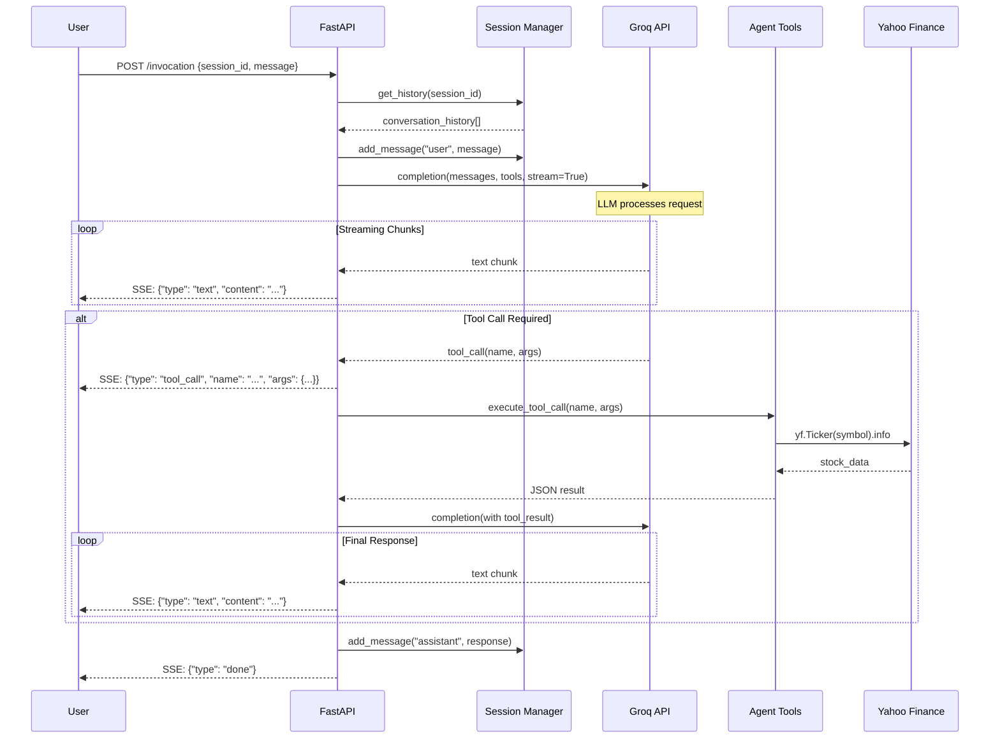
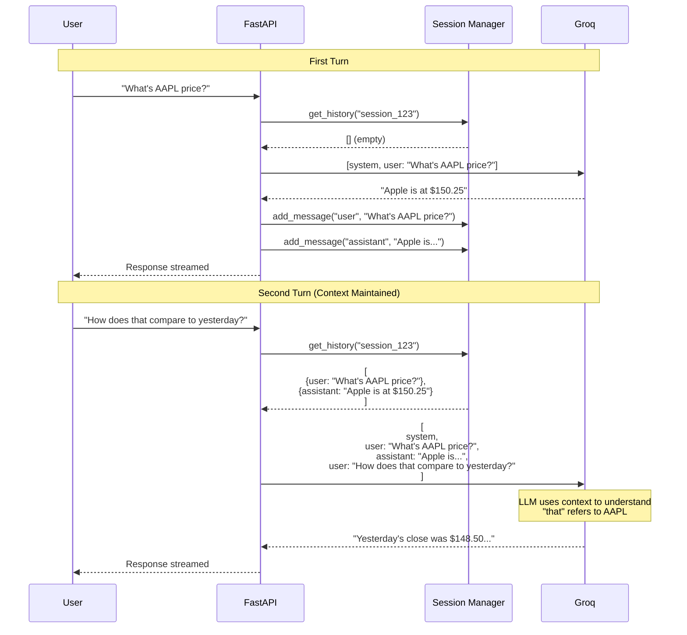
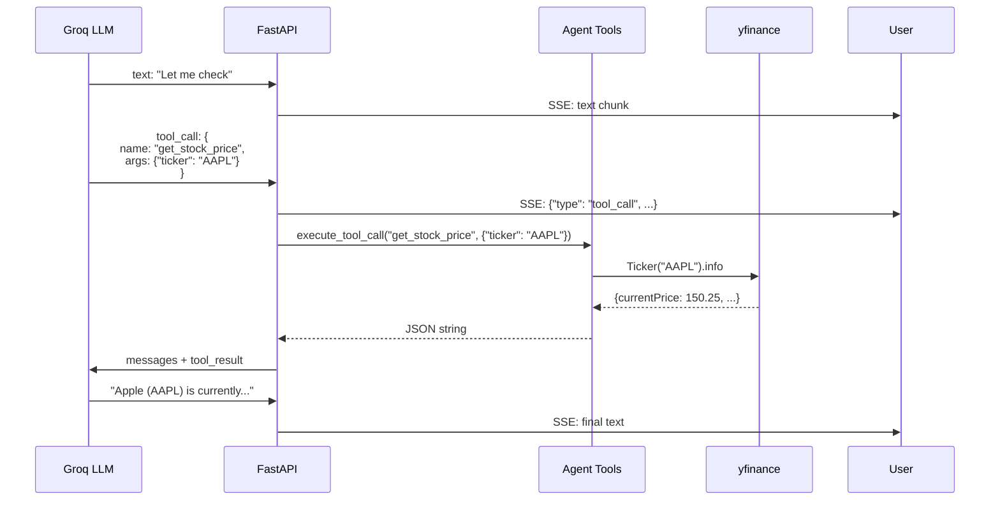

# Streaming Stock Agent - Architecture Guide

This document provides a comprehensive explanation of the streaming stock query agent system, from high-level architecture to low-level implementation details.

## Table of Contents

- [High-Level Architecture](#high-level-architecture)
- [System Components](#system-components)
- [Sequence Diagrams](#sequence-diagrams)
- [Low-Level Implementation](#low-level-implementation)
- [Key Implementation Details](#key-implementation-details)
- [Code Walkthrough](#code-walkthrough)

---

## Important: Raw Implementation Approach

> 💡 **Critical Teaching Point:** This implementation intentionally **does NOT use an agent framework** (LangGraph, Strands, Claude Agent SDK, etc.).

**Why Raw Implementation?**

This project demonstrates the **fundamental mechanics** of how LLM tool calling and streaming work at the lowest level. Understanding these mechanics is essential before using high-level frameworks.

**What You'll Learn:**

1. **Tool Schema Definition**: How to structure tool definitions with JSON Schema so the LLM understands what functions are available
2. **LLM → Tool Call**: How the LLM generates structured tool calls (function name + parameters) in its response
3. **Tool Execution**: How your application code parses the tool call and executes the actual Python function
4. **Result Handling**: How to feed tool results back to the LLM so it can incorporate them into its response
5. **Streaming Implementation**: How to stream tokens in real-time while handling tool calls mid-stream

**Agent Frameworks Abstract This:**

Frameworks like LangGraph, Strands, and Claude Agent SDK handle all of this automatically:
```python
# What frameworks do behind the scenes (simplified):
# 1. Define tools with schemas
# 2. LLM generates: {"tool": "get_stock_price", "args": {"ticker": "AAPL"}}
# 3. Framework executes: result = tools["get_stock_price"](**args)
# 4. Framework adds result to conversation
# 5. Repeat until LLM generates final text
```

In this implementation, you'll see each of these steps **explicitly in the code**, giving you complete visibility into the agent loop.

> 💡 **Key Insight:** Once you understand this raw implementation, agent frameworks will make much more sense. You'll know exactly what they're doing under the hood and when to customize vs use their defaults.

---

## High-Level Architecture

### Overview

The Streaming Stock Agent demonstrates a **conversational API pattern** with streaming responses, multi-turn conversation management, and real-time tool calling. This pattern is ideal for building responsive AI assistants that need to maintain context and provide immediate feedback.

### Architecture Pattern: Stateful Streaming API

```
┌─────────────────────────────────────────────────────────┐
│                    User Request                         │
│     "What's the price of Apple stock?"                 │
└────────────────────┬────────────────────────────────────┘
                     │
                     ▼
┌─────────────────────────────────────────────────────────┐
│              FastAPI Server (main.py)                   │
│  POST /invocation                                       │
│  - Receives session_id + message                       │
│  - Loads conversation history                          │
│  - Streams LLM response with SSE                       │
└────────────┬────────────────────────────────────────────┘
             │
             ├──────────────┬──────────────┬──────────────┐
             ▼              ▼              ▼              ▼
    ┌────────────┐  ┌────────────┐  ┌────────────┐  ┌────────┐
    │  Session   │  │   Agent    │  │   Groq     │  │ Yahoo  │
    │  Manager   │  │  (Tools)   │  │    API     │  │Finance │
    └────────────┘  └────────────┘  └────────────┘  └────────┘
         │               │               │               │
         ▼               ▼               ▼               ▼
    In-Memory      Tool Calling     LLM Inference   Stock Data
    Circular         Logic          (llama-3.3)     (yfinance)
    Buffer
    (100 msgs)
         │                                              │
         │                                              │
         └──────────────────┬───────────────────────────┘
                           │
                           ▼
                  ┌──────────────────┐
                  │ Streaming SSE    │
                  │ Response to User │
                  └──────────────────┘
```

### Key Design Decisions

1. **Server-Sent Events (SSE)**: Real-time streaming using FastAPI's StreamingResponse
2. **Session Management**: In-memory circular buffer (100 messages) per session_id
3. **Tool Calling with LiteLLM**: Unified interface to Groq API with native tool support
4. **Yahoo Finance Integration**: Real-time stock data via yfinance library
5. **Groq for Speed**: llama-3.3-70b-versatile for fast, cost-effective inference
6. **No Database**: Fully in-memory for simplicity and speed

---

## System Components

### 1. FastAPI Server

**File**: `main.py`

**Responsibilities**:
- Exposes REST API endpoints (`/ping`, `/invocation`, session management)
- Manages Server-Sent Events (SSE) streaming
- Coordinates between session manager, LLM, and tools
- Handles async streaming response generation
- Implements tool call execution loop with LiteLLM

**Key Endpoints**:
- `GET /ping` - Health check
- `POST /invocation` - Main query endpoint (streaming)
- `GET /session/{session_id}/info` - Get session metadata
- `DELETE /session/{session_id}` - Clear session history
- `GET /sessions/count` - Active session count

### 2. Session Manager

**File**: `session_manager.py`

**Technology**: In-memory Python data structures with deque

**Responsibilities**:
- Maintains conversation history per session_id
- Implements circular buffer (oldest messages auto-removed)
- Provides thread-safe access to session data
- Tracks session metadata (created_at, last_accessed)
- Returns conversation history formatted for LLM

**Data Structure**:
```python
Session:
  - session_id: str
  - messages: deque (max 100)
  - created_at: datetime
  - last_accessed: datetime

Message:
  - role: "user" | "assistant" | "tool"
  - content: str
  - timestamp: datetime
```

### 3. Agent Tools

**File**: `agent.py`

**Tools Available**:

#### get_stock_price
- Current price, previous close, change, change percentage
- Market state (OPEN, CLOSED, PRE, POST)
- Real-time data from Yahoo Finance

#### get_stock_history
- Historical prices over N days (default: 30)
- High, low, average volume
- Period change and change percentage
- Returns time series summary

#### get_company_info
- Company name, sector, industry
- Business description
- Market cap, employee count
- Website and exchange information

**Tool Definition Format**:
Tools are defined in LiteLLM-compatible JSON schema format with function references for execution.

### 4. Prompt Management

**File**: `prompts/system_prompt.txt`

The system prompt is externalized to a separate file and loaded dynamically:

**Key Instructions**:
- Use appropriate tool for each query type
- Present information conversationally
- Ask for clarification when ambiguous
- Mention Yahoo Finance as data source
- Format numbers clearly

> 💡 **Key Insight:** Externalizing prompts allows easy iteration without code changes and keeps concerns separated.

---

## Sequence Diagrams

### Overall Request Flow



### Multi-Turn Conversation Flow



### Tool Calling Mechanism



---

## Low-Level Implementation

### Streaming Response with SSE

Server-Sent Events (SSE) is a web standard for server-to-client streaming over HTTP.

**Format**:
```
data: {"type": "text", "content": "Hello"}\n\n
data: {"type": "tool_call", "name": "get_stock_price"}\n\n
data: {"type": "done"}\n\n
```

**Implementation in FastAPI**:
```python
async def _stream_agent_response(
    session_id: str,
    user_message: str
) -> AsyncGenerator[str, None]:
    # ... prepare messages ...

    response = completion(
        model="groq/llama-3.3-70b-versatile",
        messages=messages,
        tools=tools,
        stream=True  # Critical!
    )

    for chunk in response:
        delta = chunk.choices[0].delta
        if delta.content:
            # Stream text to client immediately
            yield f"data: {json.dumps({'type': 'text', 'content': delta.content})}\n\n"
```

> 💡 **Key Insight:** The `stream=True` parameter enables token-by-token streaming from Groq. FastAPI's `StreamingResponse` with `text/event-stream` media type handles the SSE protocol.

### Tool Call Iteration Loop

LLMs with tool calling can require multiple back-and-forth iterations:

1. **User query** → LLM
2. LLM decides to call tool → **Tool execution**
3. Tool result → **Back to LLM**
4. LLM generates final response → **User**

**Implementation**:
```python
max_iterations = 5
iteration = 0

while iteration < max_iterations:
    iteration += 1

    # Call LLM
    response = completion(messages, tools, stream=True)

    # Accumulate chunks and detect tool calls
    for chunk in response:
        # ... handle streaming ...

    if tool_calls:
        # Execute tools
        for tool_call in tool_calls:
            result = execute_tool_call(tool_name, args)
            # Append to messages

        # Loop continues - LLM gets tool results
    else:
        # No tool calls - we're done
        break
```

> 💡 **Key Insight:** The iteration loop is necessary because after tool execution, the LLM needs to process the results. Without this loop, tool-augmented responses wouldn't work.

### Session Circular Buffer

A circular buffer automatically removes oldest items when capacity is reached.

**Python Implementation with deque**:
```python
from collections import deque

class Session:
    def __init__(self, session_id: str, max_size: int = 100):
        self.messages = deque(maxlen=max_size)  # Auto-removes oldest!

    def add_message(self, role: str, content: str):
        message = Message(role=role, content=content)
        self.messages.append(message)  # Oldest pops automatically
```

**Why Circular Buffer?**
- Prevents unbounded memory growth
- Most recent context is most relevant
- Simple automatic cleanup

> 💡 **Key Insight:** Using `deque(maxlen=N)` gives you circular buffer behavior for free. No manual cleanup needed.

---

## Key Implementation Details

### 1. Prompt Externalization

**Before** (hardcoded):
```python
SYSTEM_PROMPT = """You are a helpful..."""
```

**After** (externalized):
```python
def get_system_prompt() -> str:
    return _load_prompt("system_prompt.txt")
```

**Benefits**:
- Easy prompt iteration without code changes
- Version control for prompts
- Separation of concerns
- Can load different prompts per use case

### 2. Tool Definition Format

Tools are defined in a LiteLLM-compatible format:

```python
{
    "name": "get_stock_price",
    "description": "Get current stock price...",  # LLM sees this
    "parameters": {
        "type": "object",
        "properties": {
            "ticker": {
                "type": "string",
                "description": "Stock ticker symbol (e.g., AAPL)"
            }
        },
        "required": ["ticker"]
    },
    "function": _get_stock_price  # Python function reference
}
```

> 💡 **Key Insight:** The `description` field is critical - it tells the LLM *when* to use the tool. Good descriptions improve tool selection accuracy.

### 3. Async Streaming Pattern

FastAPI + Python async enables efficient streaming:

```python
async def _stream_agent_response(...) -> AsyncGenerator[str, None]:
    # Async generator function
    for chunk in response:
        yield f"data: {json.dumps(...)}\n\n"  # Yields to client immediately

# Usage
return StreamingResponse(
    _stream_agent_response(session_id, message),
    media_type="text/event-stream"
)
```

**Why Async?**
- Non-blocking I/O for multiple concurrent requests
- Server can handle many streaming connections
- Efficient resource usage

### 4. Error Handling in Tool Execution

Tool execution is wrapped in try/except to prevent crashes:

```python
def execute_tool_call(tool_name: str, parameters: Dict) -> str:
    tool_func = get_tool_by_name(tool_name)

    if not tool_func:
        return json.dumps({"error": f"Tool {tool_name} not found"})

    try:
        result = tool_func(**parameters)
        return json.dumps(result, indent=2)
    except Exception as e:
        logger.error(f"Error executing tool {tool_name}: {e}")
        return json.dumps({"error": str(e)})
```

> 💡 **Key Insight:** Always return JSON from tools, even for errors. This ensures the LLM can process the response and communicate the error to the user gracefully.

---

## Code Walkthrough

### Section 1: Server Initialization

**File**: `main.py` (lines 1-50)

```python
# Load environment and setup logging
load_dotenv()
logging.basicConfig(...)

# Configuration from environment variables
HOST = os.getenv("HOST", "127.0.0.1")
PORT = int(os.getenv("PORT", "8000"))
MAX_HISTORY_SIZE = int(os.getenv("MAX_HISTORY_SIZE", "100"))
GROQ_API_KEY = os.getenv("GROQ_API_KEY")

# Initialize session manager (singleton)
session_manager = SessionManager(max_history_size=MAX_HISTORY_SIZE)

# FastAPI app with lifespan context
@asynccontextmanager
async def lifespan(app: FastAPI):
    logger.info(f"Starting Stock Query Agent API on {HOST}:{PORT}")
    yield
    logger.info("Shutting down Stock Query Agent API")

app = FastAPI(title="Stock Query Agent API", lifespan=lifespan)
```

**Teaching Points**:
- Environment-based configuration for flexibility
- Singleton pattern for session manager (one instance for all requests)
- Lifespan context for startup/shutdown hooks
- Logging from the start for observability

### Section 2: Request Models

**File**: `main.py` (lines 52-65)

```python
class InvocationRequest(BaseModel):
    session_id: str = Field(..., description="...")
    message: str = Field(..., description="...")

class PingResponse(BaseModel):
    status: str = Field(default="ok")
```

**Teaching Points**:
- Pydantic for automatic validation and OpenAPI schema
- Clear field descriptions for API documentation
- Type safety from request to response

### Section 3: Tool Conversion for LiteLLM

**File**: `main.py` (lines 67-80)

```python
def _convert_tools_for_litellm():
    return [
        {
            "type": "function",
            "function": {
                "name": tool["name"],
                "description": tool["description"],
                "parameters": tool["parameters"]
            }
        }
        for tool in STOCK_TOOLS
    ]
```

**Teaching Points**:
- LiteLLM expects specific tool format
- Conversion layer abstracts library differences
- Function references stay in STOCK_TOOLS, only schema passed to LLM

### Section 4: Core Streaming Logic

**File**: `main.py` (lines 95-200)

This is the heart of the system. Key steps:

1. **Add user message to history**:
```python
session_manager.add_message(session_id, "user", user_message)
```

2. **Prepare messages with system prompt and history**:
```python
messages = [
    {"role": "system", "content": get_system_prompt()}
] + session_manager.get_history(session_id)
```

3. **Iteration loop for tool calling**:
```python
while iteration < max_iterations:
    response = completion(
        model="groq/llama-3.3-70b-versatile",
        messages=messages,
        tools=tools,
        stream=True
    )
```

4. **Stream text chunks**:
```python
for chunk in response:
    if delta.content:
        yield f"data: {json.dumps({'type': 'text', 'content': delta.content})}\n\n"
```

5. **Detect and execute tool calls**:
```python
if tool_calls:
    for tool_call in tool_calls:
        tool_result = execute_tool_call(tool_name, tool_args)
        messages.append({"role": "tool", "content": tool_result})
```

6. **Save final response**:
```python
session_manager.add_message(session_id, "assistant", accumulated_content)
```

**Teaching Points**:
- Streaming and tool calling can coexist
- Messages list grows with conversation and tool results
- Each iteration continues from where the last left off
- Error handling at every step prevents crashes

### Section 5: Session Management Implementation

**File**: `session_manager.py`

**Circular Buffer with deque**:
```python
@dataclass
class Session:
    session_id: str
    messages: deque = field(default_factory=deque)
    max_size: int = 100

    def add_message(self, role: str, content: str):
        if len(self.messages) >= self.max_size:
            self.messages.popleft()  # Remove oldest
        self.messages.append(Message(role, content))
```

**Session Manager**:
```python
class SessionManager:
    def __init__(self, max_history_size: int = 100):
        self.sessions: Dict[str, Session] = {}

    def get_or_create_session(self, session_id: str) -> Session:
        if session_id not in self.sessions:
            self.sessions[session_id] = Session(session_id, max_size=self.max_history_size)
        return self.sessions[session_id]
```

**Teaching Points**:
- Dictionary maps session_id to Session objects
- Lazy creation (session created on first message)
- Thread-safe for async context (Python GIL)
- Simple in-memory design - no database overhead

### Section 6: Agent Tools Implementation

**File**: `agent.py`

**Tool Function Example**:
```python
def _get_stock_price(ticker: str) -> Dict[str, Any]:
    try:
        stock = yf.Ticker(ticker.upper())
        info = stock.info

        current_price = info.get('currentPrice') or info.get('regularMarketPrice')
        # ... extract data ...

        return {
            "ticker": ticker.upper(),
            "current_price": round(current_price, 2),
            "change": round(change, 2),
            # ...
        }
    except Exception as e:
        logger.error(f"Error fetching stock data: {e}")
        return {"error": str(e), "ticker": ticker.upper()}
```

**Teaching Points**:
- Always return Dict (JSON-serializable)
- Include error field for graceful failure
- Normalize inputs (e.g., ticker.upper())
- Round numbers for readability
- Log errors for debugging

### Section 7: Test Client

**File**: `test_client.py`

Simple client demonstrating SSE consumption:

```python
response = requests.post(
    f"{BASE_URL}/invocation",
    json={"session_id": session_id, "message": message},
    stream=True
)

for line in response.iter_lines():
    if line:
        line_str = line.decode('utf-8')
        if line_str.startswith('data: '):
            data = json.loads(line_str[6:])
            if data['type'] == 'text':
                print(data['content'], end='', flush=True)
```

**Teaching Points**:
- `stream=True` in requests for SSE
- Parse `data: ` prefix from each line
- Handle different event types
- Real-time console output with `end=''` and `flush=True`

---

## Known Limitations and Trade-offs

### Model Selection: Qwen3-32b vs Llama Models

> 💡 **Important Discovery:** Not all Groq models have reliable streaming function calling.

**Tested Models:**

| Model | Function Calling Reliability | Notes |
|-------|------------------------------|-------|
| `llama-3.1-8b-instant` | ❌ Unstable (~10-20% failure) | Random "Failed to call a function" errors |
| `llama-3.3-70b-versatile` | ❌ Unstable (~10-20% failure) | Tool call validation errors |
| **`qwen/qwen3-32b`** | ✅ **Stable** | **Recommended** - reliable streaming + tools |

**Why Qwen3-32b Works Better:**
- More robust function calling implementation
- Better handling of tool call streaming
- Excellent context retention for multi-turn conversations
- Fast inference with good quality

**Example Evidence:**
After switching from llama models to Qwen3, multi-turn test went from intermittent failures to 100% success rate across multiple runs.

```python
# Current configuration - stable and reliable
response = completion(
    model="groq/qwen/qwen3-32b",  # ← Stable function calling
    messages=messages,
    tools=tools,
    stream=True,
    api_key=GROQ_API_KEY
)
```

> 💡 **Teaching Point:** When building production systems, test multiple model providers/versions. Function calling reliability can vary significantly between models, even from the same provider. Always validate with real workloads before committing to a model.

---

## Summary

This architecture demonstrates modern patterns for building conversational AI APIs:

1. **Streaming for Responsiveness**: SSE provides immediate feedback
2. **Stateful Sessions**: Circular buffer maintains context without bloat
3. **Tool Integration**: LLM can query external data sources
4. **Async for Scale**: Handle many concurrent conversations
5. **Simple Deployment**: In-memory design, no database required
6. **Externalized Prompts**: Easy iteration and testing

### Why This Raw Implementation Matters

**The Agent Loop Demystified:**

```python
# This is what happens in EVERY agent framework, explicitly shown here:

1. LLM receives: [system_prompt, conversation_history, tool_schemas]
   └─> See: _convert_tools_for_litellm() converting our tool definitions

2. LLM generates response:
   - Option A: Pure text (conversation done)
   - Option B: Tool call(s) with structured JSON parameters
   └─> See: Streaming loop detecting tool_calls in delta

3. IF tool calls detected:
   - Parse function name and arguments from LLM output
   - Execute actual Python function: execute_tool_call(name, args)
   - Add result to conversation messages
   - LOOP back to step 1 (LLM now has tool results)
   └─> See: Tool execution in iteration loop (max 5 iterations)

4. LLM generates final text response incorporating tool results
   └─> See: Final response saved to session history
```

**Code Locations:**
- Tool schema definition: `agent.py` → `STOCK_TOOLS` list
- Tool execution: `agent.py` → `execute_tool_call()`
- LLM interaction loop: `main.py` → `_stream_agent_response()` while loop
- Streaming token handling: `main.py` → delta.content yielding

**Contrast with Frameworks:**

| What Frameworks Hide | Where We Show It Explicitly |
|---------------------|----------------------------|
| Tool schema formatting | `_convert_tools_for_litellm()` |
| Tool call detection | Parsing `delta.tool_calls` in stream |
| Tool execution | `execute_tool_call()` function |
| Iteration loop | `while iteration < max_iterations` |
| Result integration | `messages.append({"role": "tool", ...})` |
| Streaming mechanics | SSE generation with `yield` statements |

> 💡 **Final Teaching Point:** Agent frameworks like LangGraph, Strands, and Claude Agent SDK are powerful productivity tools, but they abstract away these mechanics. By implementing this from scratch, you gain:
> - Deep understanding of the agent loop
> - Ability to debug framework issues
> - Knowledge of when to use frameworks vs custom implementations
> - Foundation for building novel agent architectures

The system is production-ready for moderate load and serves as an excellent teaching example for:
- **Raw LLM tool calling mechanics** (the core agent pattern)
- FastAPI streaming endpoints (SSE implementation)
- Session management strategies (circular buffer)
- Async Python programming (streaming generators)
- API design for AI agents (REST + SSE)
